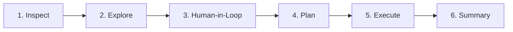

# wiiw-figaro-nam-demo

Agentic workflow demonstration for macroeconomic data analysis using FIGARO-NAM (Eurostat National Accounts Matrix).

## Context

This repository accompanies a workshop on LLM-assisted data analysis at the Vienna Institute for International Economic Studies (wiiw). It demonstrates advanced Promptotyping methodology applied to complex, partitioned time-series data.

| | |
|---|---|
| **Workshop** | AI for Data Analysis & Visualisation |
| **Date** | 10 February 2026 |
| **Contact** | David Zenz (wiiw) |

## Purpose

This use case demonstrates what agentic research workflows can achieve with Promptotyping. It serves as a showcase of the method's potential for macroeconomic research, not as hands-on material for workshop participants.

## Data

FIGARO-NAM provides National Accounts Matrices from Eurostat in Hive-partitioned Parquet format.

| Metric | Value |
|--------|-------|
| Files | 700 parquet files |
| Size | 191 MB total |
| Years | 2010–2023 (14 years) |
| Countries | 50 (EU + global economies) |
| Rows/file | ~120,000 |

**Structure:**
```
data/parquet/base=YYYY/ctr=XX/part-0.parquet
```

> **Note:** Data files are excluded from git (see `.gitignore`). Contact David Zenz for data access.

See [knowledge/data.md](knowledge/data.md) for complete documentation including schema, code lists, and access examples.

## Workflow



| Phase | Status | Description |
|-------|--------|-------------|
| **1. Inspect/Understand** | Complete | Load data, infer structure, generate data dictionary |
| **2. Explore** | Complete | Assess coverage, identify outliers, 8 analysis scripts |
| **3. Human-in-the-Loop** | In Progress | Interactive dashboard for research question selection |
| **4. Plan** | Pending | Transform questions into reproducible workflows |
| **5. Execute** | Pending | Implement analysis pipeline and generate outputs |
| **6. Summary** | Pending | Synthesize findings, distinguish facts from interpretation |

## Knowledge Base

The `knowledge/` directory provides structured context for LLM-assisted work:

| File | Purpose |
|------|---------|
| [data.md](knowledge/data.md) | Data structure, schema, code lists, access examples |
| [research.md](knowledge/research.md) | Research questions and workflow phases |
| [requirements.md](knowledge/requirements.md) | Technical dependencies and setup |
| [journal.md](knowledge/journal.md) | Working journal for iterative development |
| [glossary.md](knowledge/glossary.md) | IO analysis terminology and ESA 2010 codes |

## Interactive Dashboard

A static web dashboard is available for exploring the data interactively:

**Live Demo:** [GitHub Pages](https://digitalhumanitiecraft.github.io/wiiw-figaro-nam-demo/) (after deployment)

**Local Preview:**
```bash
cd docs && python -m http.server 8000
# Open: http://localhost:8000
```

**Dashboard Features:**

| Tab | Visualization | Description |
|-----|--------------|-------------|
| Zeitreihen | Multi-Line Chart | Macro aggregates 2010-2023 with crisis markers |
| Handelspartner | Bar Chart | Export/Import/Balance by trading partner |
| Sektoren | Diverging Bars | Sectoral YoY changes (COVID, Energy Crisis) |
| IO-Verflechtung | Bar Chart | Backward/Forward linkages, intersectoral flows |

**Technology:** D3.js v7, vanilla JavaScript, static JSON data (~47 KB)

---

## Quick Start

```bash
# Clone repository
git clone https://github.com/DigitalHumanitiesCraft/wiiw-figaro-nam-demo.git
cd wiiw-figaro-nam-demo

# Setup Python environment
python -m venv .venv
source .venv/bin/activate  # Windows: .venv\Scripts\activate
pip install pyarrow pandas matplotlib seaborn

# Place data in data/parquet/ directory
# Then load data
python -c "import pyarrow.parquet as pq; print(pq.read_table('data/parquet/').schema)"
```

## Related

- [wiiw-patent-analysis-demo](https://github.com/DigitalHumanitiesCraft/wiiw-patent-analysis-demo) – Use Case 1 from the same workshop
- [Promptotyping methodology](https://chpollin.github.io/promptotyping/)

## License

MIT
