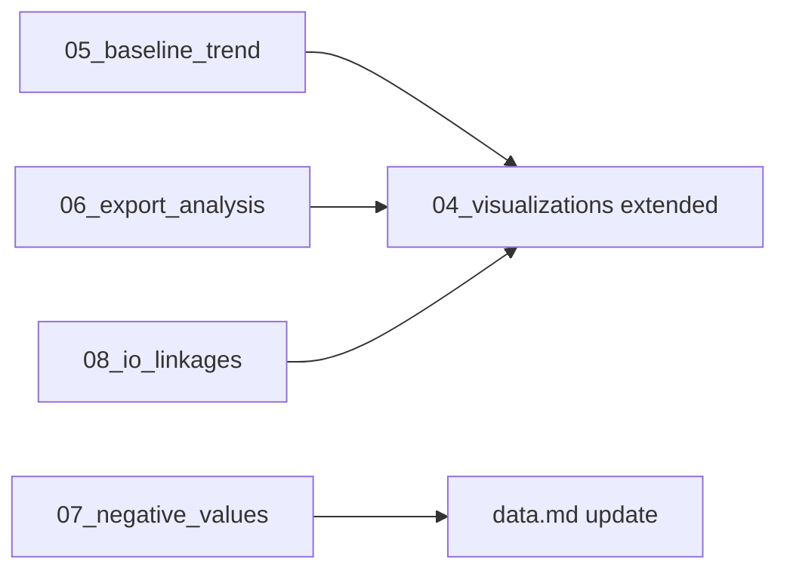

# Exploration Extension Plan

Plan for extending Phase 2 exploration with additional scripts.

---

## Objective

The existing 4 scripts cover base exploration. This extension aims to:
1. Provide deeper insights into data structure
2. Create baseline references for structural break interpretation
3. Unlock previously unused dimensions (exports, IO linkages)

---

## New Scripts

### 05_baseline_trend.py

**Purpose:** Calculate long-term trend 2010-2018 as reference for COVID evaluation

**Analysis:**
- Average annual growth (CAGR) per aggregate and country
- Extrapolate trend line to 2020
- Quantify COVID year deviation from trend

**Output:**
- `outputs/tables/baseline_trends.csv` - CAGR per country/aggregate
- `outputs/tables/trend_deviation_2020.csv` - Actual vs. trend
- `outputs/figures/trend_deviation_chart.png`

**Benefit:** Statement like "DE HH consumption was X% below long-term trend in 2020"

---

### 06_export_analysis.py

**Purpose:** Analyze export structure (mirror of Script 02 imports)

**Analysis:**
- Top export destinations per country
- Exported products by category
- Export/import balance by partner

**Output:**
- `outputs/tables/DE_exports_by_partner.csv`
- `outputs/tables/DE_exports_by_product.csv`
- `outputs/tables/trade_balance_by_partner.csv`

**Benefit:** Complete trade picture, not just import side

---

### 07_negative_values.py

**Purpose:** Categorize and understand the 204k negative values

**Analysis:**
- Distribution by Set_i/Set_j categories
- Temporal development
- Country differences

**Output:**
- `outputs/tables/negative_values_by_category.csv`
- `outputs/tables/negative_values_by_year.csv`

**Benefit:** Understanding of adjustments/balancing items in dataset

---

### 08_io_linkages.py

**Purpose:** Analyze input-output linkages between sectors

**Analysis:**
- Which sectors are main suppliers/buyers?
- Forward and backward linkages
- Top 10 intersectoral flows

**Output:**
- `outputs/tables/sector_linkages_matrix.csv`
- `outputs/tables/top_intersectoral_flows.csv`
- `outputs/figures/sector_linkages_heatmap.png`

**Benefit:** Shows economic dependencies between industries

---

## Extensions to Existing Scripts

### 03_temporal_analysis.py - Extensions

| Extension | Description |
|-----------|-------------|
| More countries | All 8 sample countries detailed, not just DE |
| Recovery analysis | 2021 vs 2019 - complete recovery? |
| Volatility | Standard deviation of YoY changes |

### 04_visualizations.py - Extensions

| Extension | Description |
|-----------|-------------|
| Trend deviation | Visualization from 05_baseline_trend |
| IO heatmap | Sector linkages from 08_io_linkages |
| Trade balance | Export/import comparison from 06_export_analysis |

---

## Documentation Updates

| File | Update |
|------|--------|
| `scripts/README.md` | Document new scripts |
| `knowledge/research.md` | Extend Phase 2 findings |
| `knowledge/journal.md` | Document Session 4 |
| `knowledge/data.md` | Add negative values explanation |

---

## Prioritization

| Priority | Script | Effort | Benefit |
|----------|--------|--------|---------|
| 1 (High) | 05_baseline_trend | Low | Improves COVID interpretation |
| 2 (High) | 07_negative_values | Low | Clarifies data understanding |
| 3 (Medium) | 06_export_analysis | Medium | Completes trade picture |
| 4 (Medium) | 08_io_linkages | High | Shows economic structure |

---

## Timeline

**Phase 2b: Extended Exploration**

```
05_baseline_trend.py     -> Execute -> Document
07_negative_values.py    -> Execute -> Document
06_export_analysis.py    -> Execute -> Document
08_io_linkages.py        -> Execute -> Document
04_visualizations.py     -> Extend  -> New figures
```

After completion: Commit and update documentation

---

## Dependencies



---

## Success Criteria

- [ ] All 4 new scripts run without errors
- [ ] New CSVs in `outputs/tables/`
- [ ] New PNGs in `outputs/figures/`
- [ ] README and documentation updated
- [ ] Commit with complete description
