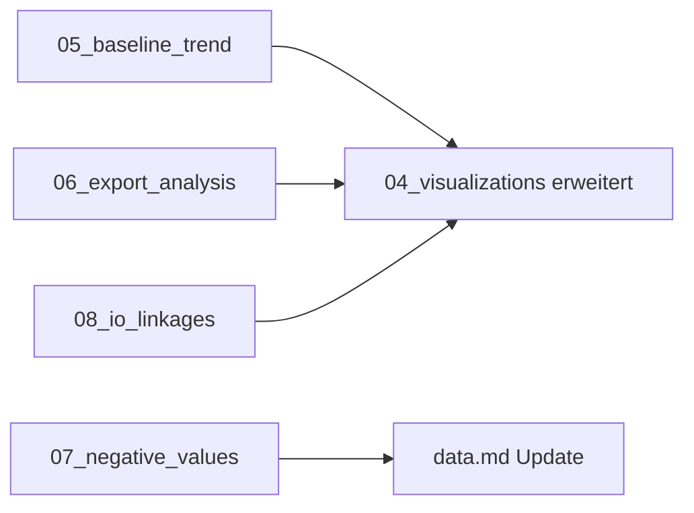

# Exploration Extension Plan

Plan fuer die Erweiterung der Phase-2-Exploration mit zusaetzlichen Scripts.

---

## Zielsetzung

Die bestehenden 4 Scripts decken Basis-Exploration ab. Diese Erweiterung soll:
1. Tiefere Einblicke in die Datenstruktur liefern
2. Baseline-Referenzen fuer Strukturbruch-Interpretation schaffen
3. Bisher ungenutzte Dimensionen erschliessen (Exporte, IO-Verflechtung)

---

## Neue Scripts

### 05_baseline_trend.py

**Zweck:** Langfristigen Trend 2010-2018 als Referenz fuer COVID-Bewertung berechnen

**Analyse:**
- Durchschnittliches jaehrliches Wachstum (CAGR) pro Aggregat und Land
- Trendlinie extrapolieren auf 2020
- Abweichung COVID-Jahr vom Trend quantifizieren

**Output:**
- `outputs/tables/baseline_trends.csv` - CAGR pro Land/Aggregat
- `outputs/tables/trend_deviation_2020.csv` - Ist vs. Trend
- `outputs/figures/trend_deviation_chart.png`

**Nutzen:** Aussage wie "DE HH-Konsum lag 2020 um X% unter dem langfristigen Trend"

---

### 06_export_analysis.py

**Zweck:** Exportstruktur analysieren (Spiegelbild zu Script 02 Importe)

**Analyse:**
- Top Exportdestinationen pro Land
- Exportierte Produkte nach Kategorie
- Export/Import-Bilanz pro Partner

**Output:**
- `outputs/tables/DE_exports_by_partner.csv`
- `outputs/tables/DE_exports_by_product.csv`
- `outputs/tables/trade_balance_by_partner.csv`

**Nutzen:** Vollstaendiges Handelsbild, nicht nur Importseite

---

### 07_negative_values.py

**Zweck:** Die 204k negativen Werte kategorisieren und verstehen

**Analyse:**
- Verteilung nach Set_i/Set_j Kategorien
- Zeitliche Entwicklung
- Laenderunterschiede

**Output:**
- `outputs/tables/negative_values_by_category.csv`
- `outputs/tables/negative_values_by_year.csv`

**Nutzen:** Verstaendnis der Adjustments/Balancing Items im Datensatz

---

### 08_io_linkages.py

**Zweck:** Input-Output-Verflechtungen zwischen Sektoren analysieren

**Analyse:**
- Welche Sektoren sind Hauptlieferanten/Hauptabnehmer?
- Vorwaerts- und Rueckwaertsverflechtung
- Top-10 intersektorale Stroeme

**Output:**
- `outputs/tables/sector_linkages_matrix.csv`
- `outputs/tables/top_intersectoral_flows.csv`
- `outputs/figures/sector_linkages_heatmap.png`

**Nutzen:** Zeigt wirtschaftliche Abhaengigkeiten zwischen Branchen

---

## Erweiterungen bestehender Scripts

### 03_temporal_analysis.py - Erweiterungen

| Erweiterung | Beschreibung |
|-------------|--------------|
| Mehr Laender | Alle 8 Sample-Laender detailliert, nicht nur DE |
| Recovery-Analyse | 2021 vs 2019 - vollstaendige Erholung? |
| Volatilitaet | Standardabweichung der YoY-Aenderungen |

### 04_visualizations.py - Erweiterungen

| Erweiterung | Beschreibung |
|-------------|--------------|
| Trend-Abweichung | Visualisierung aus 05_baseline_trend |
| IO-Heatmap | Sektorverflechtung aus 08_io_linkages |
| Handelsbilanz | Export/Import-Vergleich aus 06_export_analysis |

---

## Dokumentation Updates

| Datei | Update |
|-------|--------|
| `scripts/README.md` | Neue Scripts dokumentieren |
| `knowledge/research.md` | Phase 2 Findings erweitern |
| `knowledge/journal.md` | Session 4 dokumentieren |
| `knowledge/data.md` | Negative Values Erklaerung ergaenzen |

---

## Priorisierung

| Prioritaet | Script | Aufwand | Nutzen |
|------------|--------|---------|--------|
| 1 (Hoch) | 05_baseline_trend | Niedrig | Verbessert COVID-Interpretation |
| 2 (Hoch) | 07_negative_values | Niedrig | Klaert Datenverstaendnis |
| 3 (Mittel) | 06_export_analysis | Mittel | Komplettiert Handelsbild |
| 4 (Mittel) | 08_io_linkages | Hoch | Zeigt Wirtschaftsstruktur |

---

## Zeitplan

**Phase 2b: Extended Exploration**

```
05_baseline_trend.py     -> Ausfuehren -> Dokumentieren
07_negative_values.py    -> Ausfuehren -> Dokumentieren
06_export_analysis.py    -> Ausfuehren -> Dokumentieren
08_io_linkages.py        -> Ausfuehren -> Dokumentieren
04_visualizations.py     -> Erweitern  -> Neue Grafiken
```

Nach Abschluss: Commit und Update der Dokumentation

---

## Abhaengigkeiten



---

## Erfolgskriterien

- [ ] Alle 4 neuen Scripts laufen fehlerfrei
- [ ] Neue CSVs in `outputs/tables/`
- [ ] Neue PNGs in `outputs/figures/`
- [ ] README und Dokumentation aktualisiert
- [ ] Commit mit vollstaendiger Beschreibung
