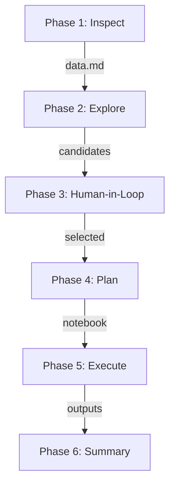

# Research Documentation: FIGARO-NAM Analysis

## Research Context

Macroeconomic analysis of National Accounts data to understand economic structures, sectoral linkages, and temporal dynamics across European and global economies.

**Data scope:** 50 countries, 14 years (2010–2023), ~84 million data points

---

## Workflow Phases



| Phase | Status | Output |
|-------|--------|--------|
| 1. Inspect/Understand | Complete | `data.md` with schema, codes |
| 2. Explore | In Progress | `scripts/01-03*.py`, `outputs/` |
| 3. Human-in-the-Loop | Pending | Selected questions |
| 4. Plan | Pending | Notebook outline |
| 5. Execute | Pending | Analysis outputs |
| 6. Summary | Pending | Final report |

---

### Phase 1: Inspect/Understand [Complete]

**Objective:** Establish comprehensive understanding of data structure and content.

**Completed tasks:**
- [x] Load partitioned Parquet data
- [x] Infer schema and variable types
- [x] Generate data dictionary with descriptions
- [x] Document code lists (181 codes for Set_i/Set_j)
- [x] Identify 50 countries, 14 years coverage

**Outputs:**
- [data.md](data.md) – Complete variable documentation
- Schema: `Set_i`, `m`, `Set_j`, `value`, `base`, `ctr`

---

### Phase 2: Explore [In Progress]

**Objective:** Assess data quality and identify analysis opportunities.

**Scripts created:**

| Script | Purpose | Status |
|--------|---------|--------|
| `scripts/01_data_quality.py` | Coverage, missing values, distributions | Ready |
| `scripts/02_top_flows.py` | Top flows, sectors, trade partners | Ready |
| `scripts/03_temporal_analysis.py` | Time series, structural breaks | Ready |

**Tasks:**
| Task | Method | Script |
|------|--------|--------|
| Coverage analysis | Check all 700 country-year combinations | 01 |
| Outlier detection | IQR method on value distributions | 01 |
| Pattern discovery | Top flows by magnitude, dominant sectors | 02 |
| Temporal trends | Year-over-year changes, structural breaks | 03 |

**Preliminary findings (from ad-hoc analysis):**

COVID Impact (Germany 2019-2020):
- Household consumption: -7.1%
- Government consumption: +7.2%
- Most affected: Travel agencies (N79) -56%, Airlines (H51) -46%
- Growth: Healthcare (Q86) +22%

**Expected outputs:**
- `outputs/` folder with CSV files
- Candidate research questions based on patterns

---

### Phase 3: Human-in-the-Loop

**Objective:** Collaborative selection of research questions.

**Selection matrix:**

| Criterion | Weight | Description |
|-----------|--------|-------------|
| Feasibility | High | Can be answered with available data |
| Interpretability | High | Results are meaningful to stakeholders |
| Relevance | Medium | Policy or academic significance |
| Novelty | Low | Adds to existing knowledge |

**Process:**
1. Review Phase 2 candidates
2. Score against criteria
3. Select 2–3 questions for implementation

---

### Phase 4: Plan

**Objective:** Transform research questions into reproducible workflows.

**Notebook structure:**

```
1. Setup & Data Loading
2. Data Preparation
3. Analysis
4. Visualization
5. Interpretation
6. Limitations
```

**For each question, define:**
- Data filters (countries, years, sectors)
- Aggregation method
- Metrics to compute
- Visualization types
- Validation checks

---

### Phase 5: Execute

**Objective:** Implement analysis pipeline and generate outputs.

**Potential output types:**

| Type | Description | Tools |
|------|-------------|-------|
| **Sankey/Flow** | Income generation → distribution → use | plotly, networkD3 |
| **Structural Breaks** | COVID (2020), Energy crisis (2022) | scipy, statsmodels |
| **Clustering** | Country typologies by structure | scikit-learn |
| **Import Dependency** | Sectoral external exposure | pandas aggregation |

---

### Phase 6: Summary

**Objective:** Synthesize findings with appropriate epistemic framing.

**Structure:**

| Section | Content |
|---------|---------|
| Key findings | Direct observations from data |
| Interpretations | What this might mean |
| Limitations | Data constraints, caveats |
| Next steps | Hypotheses for future work |

**Epistemic markers:**
- **[FACT]** Direct data observation
- **[INFERENCE]** Interpretation requiring assumptions
- **[HYPOTHESIS]** Question for future investigation

---

## Candidate Research Questions

*To be refined during Phase 2/3*

| # | Question | Feasibility | Data Requirements |
|---|----------|-------------|-------------------|
| 1 | How has sectoral GDP composition changed across EU since 2010? | High | Set_i industries, value by year |
| 2 | Which sectors show highest import dependency? | High | m (partner), Set_i products |
| 3 | What structural breaks occurred 2020–2022? | Medium | Time series, change detection |
| 4 | Can countries be clustered by economic structure? | Medium | Cross-country comparison |
| 5 | How do core vs. peripheral EU economies differ? | Medium | Pre-defined country groups |

---

## Methodological Notes

### Promptotyping Approach

| Principle | Application |
|-----------|-------------|
| Context Engineering | `knowledge/` folder with structured docs |
| Iterative Development | Track progress in `journal.md` |
| Human-in-the-Loop | Phase 3 decision point |
| Reproducibility | Notebook-based workflows |

### Quality Assurance

- [ ] Cross-validate against Eurostat published aggregates
- [ ] Plausibility checks (GDP totals, known economic events)
- [ ] Document all assumptions and transformations
- [ ] Peer review of interpretation claims

### Key References

- [Eurostat FIGARO](https://ec.europa.eu/eurostat/web/esa-supply-use-input-tables/figaro)
- [NACE Rev. 2 Classification](https://ec.europa.eu/eurostat/web/nace-rev2)
- [CPA 2.1 Classification](https://ec.europa.eu/eurostat/web/cpa)
