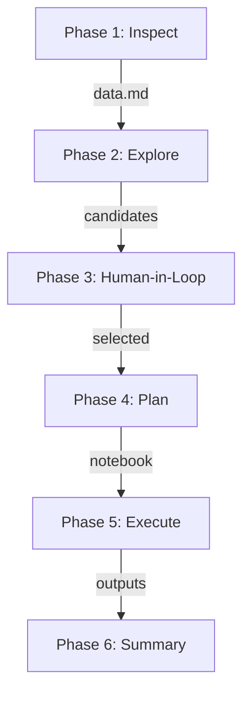

# Research Documentation: FIGARO-NAM Analysis

## Research Context

Macroeconomic analysis of National Accounts data to understand economic structures, sectoral linkages, and temporal dynamics across European and global economies.

**Data scope:** 50 countries, 14 years (2010–2023), ~84 million data points

---

## Workflow Phases



| Phase | Status | Output |
|-------|--------|--------|
| 1. Inspect/Understand | Complete | `data.md` with schema, codes |
| 2a. Explore (Base) | Complete | `scripts/01-04*.py`, base outputs |
| 2b. Explore (Extended) | Complete | `scripts/05-08*.py`, extended outputs |
| 3. Human-in-the-Loop | In Progress | Interactive dashboard (`docs/`) |
| 4. Plan | Pending | Notebook outline |
| 5. Execute | Pending | Analysis outputs |
| 6. Summary | Pending | Final report |

---

### Phase 1: Inspect/Understand [Complete]

**Objective:** Establish comprehensive understanding of data structure and content.

**Completed tasks:**
- [x] Load partitioned Parquet data
- [x] Infer schema and variable types
- [x] Generate data dictionary with descriptions
- [x] Document code lists (181 codes for Set_i/Set_j)
- [x] Identify 50 countries, 14 years coverage

**Outputs:**
- [data.md](data.md) – Complete variable documentation
- Schema: `Set_i`, `m`, `Set_j`, `value`, `base`, `ctr`

---

### Phase 2a: Explore - Base [Complete]

**Objective:** Assess data quality and identify analysis opportunities.

**Scripts created:**

| Script | Purpose | Status |
|--------|---------|--------|
| `scripts/01_data_quality.py` | Coverage, missing values, distributions | Executed |
| `scripts/02_top_flows.py` | Top flows, sectors, trade partners | Executed |
| `scripts/03_temporal_analysis.py` | Time series, structural breaks | Executed |
| `scripts/04_visualizations.py` | Heatmaps, bar charts, time series | Executed |

**Data Quality Results:**
- 69.8 million rows total across 700 country-year files
- Complete coverage: all 50 countries x 14 years present
- 204,488 negative values (adjustments/balancing items)
- No missing values

**Key Empirical Findings:**

COVID-19 Impact (2019-2020):
| Country | HH Consumption | Gov Consumption |
|---------|----------------|-----------------|
| ES | -17.0% | +4.9% |
| GR | -16.1% | +3.0% |
| IT | -12.3% | +2.7% |
| DE | -7.1% | +7.2% |
| PL | -4.7% | +4.4% |

Sektorale Asymmetrie (Germany):
- Verlierer: N79 Travel -56%, H51 Airlines -46%, I Hotels -32%
- Gewinner: Q86 Healthcare +22%, K66 Financial +14%, H53 Postal +11%

Energy Crisis (2021-2022):
- Nominale HH-Konsumanstiege 10-19% (Inflationseffekt)
- Interpretation erfordert externe Deflator-Daten

**Outputs Phase 2a:**
- `outputs/tables/` - 15 CSV data files
- `outputs/figures/` - 4 PNG visualizations

---

### Phase 2b: Explore - Extended [Complete]

**Objective:** Deeper analysis with baseline trends, export structure, and IO linkages.

**Scripts created:**

| Script | Purpose | Status |
|--------|---------|--------|
| `scripts/05_baseline_trend.py` | CAGR 2010-2018, trend deviation analysis | Executed |
| `scripts/06_export_analysis.py` | Export structure, trade balance by partner | Executed |
| `scripts/07_negative_values.py` | Categorize negative values in dataset | Executed |
| `scripts/08_io_linkages.py` | Intersectoral linkages, backward/forward | Executed |

**Key Findings Phase 2b:**

Trend Deviation Analysis (COVID vs. CAGR 2010-2018):
| Country | HH Cons Deviation from Trend |
|---------|------------------------------|
| ES | -18.1% |
| IT | -13.8% |
| AT | -12.3% |
| GR | -11.2% |
| DE | -9.7% |

Intersectoral Linkages (Germany 2019):
- Highest backward linkage: Motor vehicles, Construction, Machinery
- Highest forward linkage: Legal/Accounting (M69_70), Real estate (L), Wholesale (G46)
- Total intermediate consumption: 2.5 billion EUR (domestic flows)

Export Structure (Germany 2019):
- Top destinations: US (9.8%), CN (9.6%), FR (8.1%), NL (7.6%)
- Top categories: Services (33%), Manufacturing other (23%), Vehicles (11%)

Negative Values Analysis:
- ~36k negative values in 8-country sample (14 years)
- Mainly B-Balances (adjustments) and D-Transactions (subsidies > taxes)
- Legitimate ESA 2010 accounting entries, not errors

**Outputs Phase 2b:**
- `outputs/tables/` - 17 additional CSV files (32 total)
- `outputs/figures/` - 3 additional PNG visualizations (7 total)

**Knowledge Documentation:**
- `knowledge/glossary.md` - IO analysis and econometrics terminology
- `knowledge/exploration_plan.md` - Planning document for Phase 2b

---

### Phase 3: Human-in-the-Loop [In Progress]

**Objective:** Workshop participants collaboratively select 2-3 research questions.

**Implementation:** Interactive Web Dashboard

An interactive D3.js dashboard has been created to support the selection process:

| Component | Description |
|-----------|-------------|
| **URL** | `docs/index.html` (GitHub Pages deployable) |
| **Technology** | D3.js v7, vanilla JS, static JSON |
| **Data Size** | ~47 KB (5 JSON files) |

**Dashboard Tabs:**

| Tab | Visualization | Research Questions Addressed |
|-----|--------------|------------------------------|
| Zeitreihen | Multi-line chart | B3 (Energy vs COVID), country comparison |
| Handelspartner | Bar chart | D1-D3 (Import dependency, trade structure) |
| Sektoren | Diverging bars | B2, B4 (Sectoral dynamics, volatility) |
| IO-Verflechtung | Bar chart | A1-A2 (Circular flow, linkages) |

**Data Availability:**

| Country | Time Series | Trade | Sectors | Linkages |
|---------|-------------|-------|---------|----------|
| DE | Yes | Yes | Yes | Yes |
| FR | Yes | - | - | - |
| IT | Yes | - | - | - |
| ES | Yes | - | - | - |
| AT | Yes | - | - | - |
| PL | Yes | - | - | - |
| GR | Yes | - | - | - |
| NL | Yes | - | - | - |

**David's 4 Analysis Types:**
1. **Sankey/Flow** - Circular flow visualization (Production → Income → Use)
2. **Structural Breaks** - COVID 2020, Energy 2022 quantification
3. **Clustering** - Country/sector typologies by structure
4. **Import Dependency** - External exposure indicators

**Selection Criteria:**

| Criterion | Weight | Description |
|-----------|--------|-------------|
| Feasibility | High | Achievable within workshop time with available data |
| Interpretability | High | Results tell a clear economic story |
| Relevance | Medium | Policy or academic significance |
| Visual Impact | Medium | Suitable for presentation/publication |

**Pre-scored Candidates:**

| ID | Question | Type | Effort | Score |
|----|----------|------|--------|-------|
| B3 | Energy crisis vs COVID recovery | Breaks | Low | Recommended |
| D1 | Sectoral import dependency DE | Import | Low | Recommended |
| A1 | Circular flow visualization DE | Sankey | Medium | Recommended |
| C3 | Southern vs Northern EU response | Cluster | Medium | Alternative |
| B4 | Sectoral volatility across crises | Breaks | Medium | Alternative |

**Known Limitations (to discuss):**
- All values nominal - energy crisis interpretation requires external deflators
- Vertical specialization (VS) requires Leontief inverse - complex
- Country clustering needs pre-defined groups or unsupervised algorithm

**Process:**
1. Present 4 analysis types with examples from Phase 2
2. Use interactive dashboard to explore data patterns
3. Discuss feasibility and interest
4. Vote on 2-3 questions for Phase 4/5 implementation

---

### Phase 4: Plan

**Objective:** Transform research questions into reproducible workflows.

**Notebook structure:**

```
1. Setup & Data Loading
2. Data Preparation
3. Analysis
4. Visualization
5. Interpretation
6. Limitations
```

**For each question, define:**
- Data filters (countries, years, sectors)
- Aggregation method
- Metrics to compute
- Visualization types
- Validation checks

---

### Phase 5: Execute

**Objective:** Implement analysis pipeline and generate outputs.

**Potential output types:**

| Type | Description | Tools |
|------|-------------|-------|
| **Sankey/Flow** | Income generation → distribution → use | plotly, networkD3 |
| **Structural Breaks** | COVID (2020), Energy crisis (2022) | scipy, statsmodels |
| **Clustering** | Country typologies by structure | scikit-learn |
| **Import Dependency** | Sectoral external exposure | pandas aggregation |

---

### Phase 6: Summary

**Objective:** Synthesize findings with appropriate epistemic framing.

**Structure:**

| Section | Content |
|---------|---------|
| Key findings | Direct observations from data |
| Interpretations | What this might mean |
| Limitations | Data constraints, caveats |
| Next steps | Hypotheses for future work |

**Epistemic markers:**
- **[FACT]** Direct data observation
- **[INFERENCE]** Interpretation requiring assumptions
- **[HYPOTHESIS]** Question for future investigation

---

## Candidate Research Questions

*Based on David Zenz's 4 analysis types for Phase 3 selection*

---

### Type A: Sankey/Flow - Circular Flow Visualization

**Objective:** Show income generation → distribution → use as clean story from production to final demand.

| # | Question | Feasibility | Data Available | Gap/Challenge |
|---|----------|-------------|----------------|---------------|
| A1 | How does value flow from production through income to final use in Germany? | High | D11 (wages), B2 (surplus), P3 (consumption), P51G (investment) | Need to map Set_i/Set_j to flow stages |
| A2 | How do income sources differ between manufacturing and services? | High | Industry codes x D-codes | Aggregation logic needed |
| A3 | What share of household income comes from wages vs. transfers? | Medium | D11, D62 in data | Sector attribution (S.14) |

**Data Check:**
- [x] Production side: CPA products, NACE industries
- [x] Income generation: D11 (wages), D12 (employer contributions), B2 (operating surplus), B3 (mixed income)
- [x] Distribution: D4 (property income), D5 (taxes), D61/D62 (social transfers)
- [x] Final use: P3_S13 (gov), P3_S14 (HH), P51G (investment), P6 (exports)

---

### Type B: Structural Breaks / Regime Shifts

**Objective:** Identify periods where flows change sharply, quantify biggest changes, visualize.

| # | Question | Feasibility | Data Available | Gap/Challenge |
|---|----------|-------------|----------------|---------------|
| B1 | Which countries experienced the largest COVID shock (2020) relative to trend? | High | CAGR + deviation analysis done | Completed in Script 05 |
| B2 | How did sectoral composition shift during COVID (winners vs. losers)? | High | Sector dynamics done | Completed in Script 03 |
| B3 | Did the 2022 energy crisis reverse COVID recovery patterns? | High | Time series 2021-2023 | Need 2021/2022/2023 comparison |
| B4 | Which sectors show highest volatility across crises? | Medium | YoY changes by sector | Standard deviation analysis |

**Data Check:**
- [x] COVID impact: HH consumption -7% to -17% across countries (documented)
- [x] Sectoral asymmetry: Travel -56%, Healthcare +22% (documented)
- [x] Trend deviation: ES -18.1%, IT -13.8% below trend (documented)
- [ ] Recovery analysis: 2021 vs 2019 not yet computed
- [ ] Energy crisis detail: 2022 nominal increases, need real interpretation caveat

**Limitation:** All values nominal. Energy crisis 2022 shows +10-19% HH consumption but this is inflation effect, not real growth. External deflators needed for real interpretation.

---

### Type C: Clustering / Typologies

**Objective:** Cluster countries and/or sectors by structural fingerprints, explain drivers.

| # | Question | Feasibility | Data Available | Gap/Challenge |
|---|----------|-------------|----------------|---------------|
| C1 | Can EU countries be grouped by economic structure similarity? | Medium | All 50 countries, all years | Need feature engineering |
| C2 | Which sectors have similar input structures (backward linkage profile)? | Medium | Linkage matrix done | Clustering algorithm needed |
| C3 | Do Southern EU economies show different COVID response patterns? | High | Country comparison done | Pre-define country groups |

**Data Check:**
- [x] Cross-country data: 50 countries, 14 years
- [x] Structural features possible: HH share, Gov share, Investment share, Export orientation
- [x] Sectoral features: Backward/forward linkages computed
- [ ] Clustering algorithm: Not implemented (scikit-learn available)

**Proposed Features for Country Clustering:**
1. HH consumption / total domestic use
2. Government consumption / total domestic use
3. Investment (P51G) / total domestic use
4. Export orientation (P6 / total output)
5. Import dependency (foreign flows / total flows)
6. Manufacturing share of value added
7. Services share of value added

---

### Type D: Import Dependency / External Exposure

**Objective:** Construct indicators of import reliance, compare across countries/sectors.

| # | Question | Feasibility | Data Available | Gap/Challenge |
|---|----------|-------------|----------------|---------------|
| D1 | Which sectors show highest import dependency in Germany? | High | Imports by product done | Need IPR formula |
| D2 | How does import structure differ between DE, FR, IT? | High | Can load multiple countries | Multi-country comparison script |
| D3 | Which trading partners are most critical for key sectors? | High | Partner x product data | Concentration index (HHI) |
| D4 | Has import dependency changed 2010-2023? | Medium | Time series available | Longitudinal analysis |

**Data Check:**
- [x] Import flows: m != ctr filters work
- [x] Import by partner: Top partners identified (WRL_REST, US, CN, FR)
- [x] Import by product: Product breakdown available
- [ ] IPR calculation: Formula documented but not implemented
- [ ] Vertical specialization: Requires Leontief inverse (complex)

**Import Penetration Ratio (IPR) Formula:**
```
IPR = Imports / (Domestic Production - Exports + Imports)
```

**Limitation:** Full Leontief-based indicators (VS, FVASH) require matrix inversion. Simpler flow-based IPR is feasible.

---

## Feasibility Summary for Phase 3 Selection

| Type | Recommended Question | Effort | Workshop Suitability |
|------|---------------------|--------|---------------------|
| A. Sankey | A1: Circular flow for Germany | Medium | Good - visual, educational |
| B. Breaks | B3: Energy crisis vs COVID recovery | Low | Excellent - extends existing |
| C. Cluster | C3: Southern vs Northern EU response | Medium | Good - interpretable |
| D. Import | D1: Sectoral import dependency DE | Low | Excellent - policy relevant |

**Recommended Selection (2-3 for workshop):**
1. **B3** - Low effort, builds on existing analysis
2. **D1** - Low effort, clear policy relevance
3. **A1** - Medium effort, best for visual storytelling

---

## Methodological Notes

### Promptotyping Approach

| Principle | Application |
|-----------|-------------|
| Context Engineering | `knowledge/` folder with structured docs |
| Iterative Development | Track progress in `journal.md` |
| Human-in-the-Loop | Phase 3 decision point |
| Reproducibility | Notebook-based workflows |

### Quality Assurance

- [ ] Cross-validate against Eurostat published aggregates
- [ ] Plausibility checks (GDP totals, known economic events)
- [ ] Document all assumptions and transformations
- [ ] Peer review of interpretation claims

### Key References

- [Eurostat FIGARO](https://ec.europa.eu/eurostat/web/esa-supply-use-input-tables/figaro)
- [NACE Rev. 2 Classification](https://ec.europa.eu/eurostat/web/nace-rev2)
- [CPA 2.1 Classification](https://ec.europa.eu/eurostat/web/cpa)
- [ESA 2010 und FIGARO Referenzdokumentation](ESA%202010%20und%20FIGARO%20Referenzdokumentation.md) - Local domain knowledge
