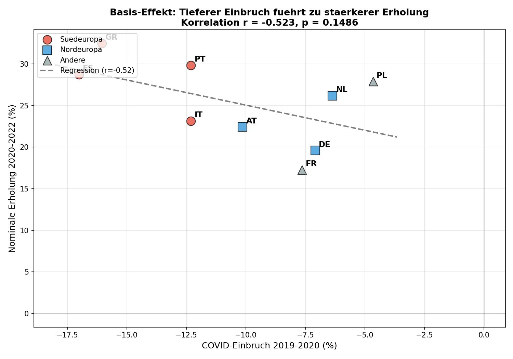
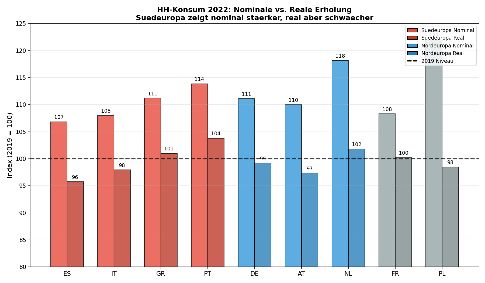
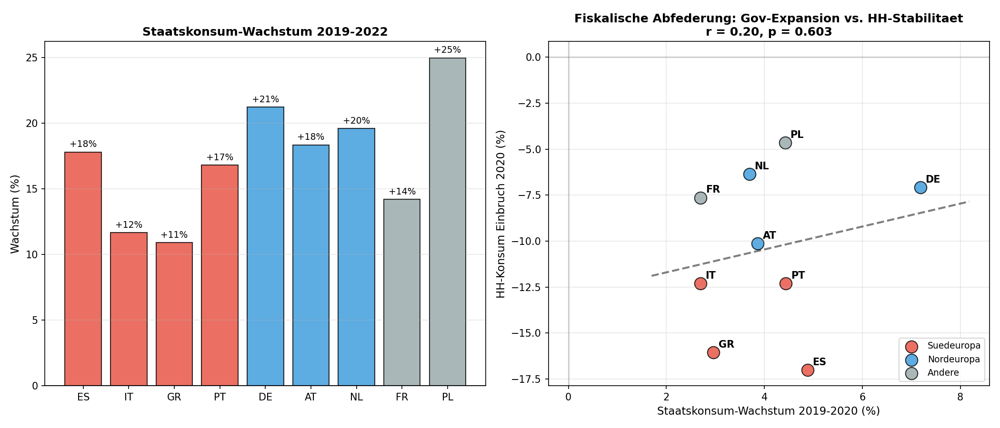

# Energy Crisis and COVID Recovery: A Comparison between Southern and Northern Europe

**Run:** run-2026-01-16-1430
**Date:** 2026-01-16

---

## 1. Research Question

### What was investigated?

This analysis examines whether the 2022 energy crisis slowed COVID recovery in household consumption of Southern European countries (Spain, Italy, Greece, Portugal) compared to Northern European countries (Germany, Austria, Netherlands).

The central hypothesis (H_int) was:

> Southern European countries show stronger nominal but weaker real recovery in 2022 than Northern Europe, with the difference partially cushioned by higher government consumption expansion. The apparently stronger nominal rebound is primarily a base effect of the deeper COVID drop in 2020.

### Why is this relevant?

The COVID-19 pandemic and the subsequent 2022 energy crisis affected European economies to varying degrees. Southern Europe, with its tourism dependency and structural differences, experienced deeper drops during the pandemic. The question of whether the recovery was sustainable or overstated by inflation effects is of central importance for economic policy assessment.

---

## 2. Data Basis

### Primary Source

[FACT] The analysis is based on the FIGARO-NAM dataset (Eurostat), provided via wiiw. [Source: validation.md:17-27]

| Feature | Description |
|---------|-------------|
| Source | Eurostat FIGARO-NAM (Full International and Global Accounts for Research in Input-Output Analysis - National Accounts Matrix) |
| Format | Apache Parquet, Hive-partitioned |
| Period | 2010-2023 |
| Unit | Million EUR (nominal) |

### Country Selection

| Region | Countries | Selection Rationale |
|--------|-----------|---------------------|
| Southern Europe | ES, IT, GR, PT | Tourism-dependent economies, higher COVID impact |
| Northern Europe | DE, AT, NL | Industrial countries with lower tourism dependency |
| Reference | FR, PL | Additional comparison points |

### Variables

| Variable | Code | Description |
|----------|------|-------------|
| Household consumption | P3_S14 | Consumption expenditure of private households |
| Government consumption | P3_S13 | Government consumption expenditure |

### Deflation Methodology

[FACT] Real values were calculated using HICP deflators, rebased to 2019=100.

**Data source:** Eurostat prc_hicp_aind (Harmonised Index of Consumer Prices - annual data)
**URL:** https://ec.europa.eu/eurostat/databrowser/view/prc_hicp_aind
**Retrieved:** 2026-01-16

| Country | HICP 2022 (2015=100) | HICP 2022 (2019=100) |
|---------|----------------------|----------------------|
| DE | 120.3 | 112.0 |
| AT | 122.5 | 113.0 |
| NL | 126.4 | 116.1 |
| ES | 118.5 | 111.6 |
| IT | 116.1 | 110.3 |
| GR | 114.4 | 110.1 |
| PT | 116.6 | 109.7 |

### Limitations

| Limitation | Impact |
|------------|--------|
| Nominal FIGARO data | Inflation effects require external deflation |
| Aggregated consumption variable | No distinction by goods (energy vs. other) |
| Small sample (n=9) | Limited statistical significance |
| HICP as deflator | Not perfect for consumption deflation, but standard methodology |

---

## 3. Exploration

### Existing COVID Analyses

Preliminary exploration identified clear patterns in the 2020 COVID drop:

[FACT] Southern Europe suffered stronger COVID drops (-12% to -17%) than the comparison group (-6% to -10%). [Source: exploration-report.md:69]

| Country | Group | COVID Drop 2020 |
|---------|-------|-----------------|
| ES | Southern Europe | -17.0% |
| GR | Southern Europe | -16.1% |
| IT | Southern Europe | -12.3% |
| PT | Southern Europe | -12.3% |
| AT | Northern Europe | -10.1% |
| DE | Northern Europe | -7.1% |
| NL | Northern Europe | -6.4% |

### Data Quality

[FACT] All analyzed countries have complete time series 2019-2023. Portugal was additionally extracted from the Parquet dataset. [Source: validation.md:134-140]

### Hypothesis Formation

Based on the exploration, five hypotheses were formulated:

1. **H1:** Differential recovery speed (nominal vs. real)
2. **H2:** Tourism dependency as driver
3. **H3:** Energy intensity of consumption
4. **H4:** Fiscal cushioning
5. **H5:** Base effect of COVID depth

The integrated hypothesis H_int combines H1, H4, and H5 as methodologically prioritized. [Source: hypotheses.md:186-244]

---

## 4. Findings

### 4.1 Base Effect (H5) - CONFIRMED

[FACT] The correlation between COVID drop 2020 and nominal recovery 2020-2022 is r = -0.523 (p = 0.1486). [Source: validation.md:91-94]

| Region | COVID Drop 2020 | Nominal Recovery 2020-2022 |
|--------|-----------------|----------------------------|
| Southern Europe (Average) | -14.4% | +28.6% |
| Northern Europe (Average) | -7.9% | +22.7% |

[Source: basis_effect_analysis.csv]

| Country | COVID Drop (%) | Recovery 2020-2022 (%) | Net Change 2019-2022 (%) |
|---------|----------------|------------------------|--------------------------|
| ES | -17.0 | +28.7 | +6.8 |
| IT | -12.3 | +23.2 | +8.0 |
| GR | -16.1 | +32.5 | +11.2 |
| PT | -12.3 | +29.8 | +13.9 |
| DE | -7.1 | +19.6 | +11.1 |
| AT | -10.1 | +22.4 | +10.0 |
| NL | -6.4 | +26.2 | +18.2 |

[INFERENCE] The moderate negative relationship (r = -0.52) shows that countries with deeper COVID drops tend to have higher percentage recovery rates. This is a statistical-mathematical base effect, not genuine "outperformance".

**Figure 1: The base effect explains apparent recovery differentials.** The scatter plot shows the systematic negative relationship (r = -0.52) between COVID drop 2020 and percentage recovery 2020-2022. Spain (ES) with the deepest drop (-17%) shows the visually strongest recovery, but this effect is primarily mathematically driven: those who fall deeper have more to catch up in percentage terms. The regression line illustrates that about half of the variance in recovery rates can be explained by drop depth. Southern European countries (red) cluster in the area of high drops and high recovery rates, while Northern European countries (blue) show more moderate values.

---

### 4.2 Nominal vs. Real Recovery (H1) - NOT CONFIRMED

[FACT] The nominal and real recovery indices (2019=100) for 2022 show an unexpected pattern. [Source: recovery_comparison.csv, validation.md:101-108]

| Region | Nominal Index 2022 | Real Index 2022 | Difference |
|--------|--------------------|-----------------|-----------|
| Southern Europe (Average) | 110.0 | 99.6 | +10.4 |
| Northern Europe (Average) | 113.1 | 99.5 | +13.6 |

**Detailed country values 2022:**

| Country | Region | Nominal Index | HICP Deflator | Real Index |
|---------|--------|---------------|---------------|------------|
| ES | South | 106.8 | 111.6 | 95.8 |
| IT | South | 108.0 | 110.3 | 97.9 |
| GR | South | 111.2 | 110.1 | 101.0 |
| PT | South | 113.9 | 109.7 | 103.8 |
| DE | North | 111.1 | 112.0 | 99.2 |
| AT | North | 110.0 | 113.0 | 97.4 |
| NL | North | 118.2 | 116.1 | 101.8 |

[Source: recovery_comparison.csv:1-47]

[INFERENCE] Contrary to the hypothesis, Northern Europe shows stronger nominal recovery (113.1 vs. 110.0). In real terms, both regions converge to practically identical levels (ca. 99.5). The higher nominal-real difference in the North (+13.6 vs. +10.4) reflects the stronger energy price inflation in DE, AT, and NL in 2022.

**Figure 2: Northern Europe shows nominally stronger recovery - the opposite of the hypothesis.** The bar comparison reveals the central finding of this analysis: contrary to expectations, the nominal recovery index 2022 in Northern Europe (113.1) exceeds the Southern European value (110.0). The Netherlands leads with 118.2, while Spain shows the lowest value at 106.8. The real indices (deflated with HICP 2019=100) show remarkable convergence: both regions reach practically identical levels around 99.5 - just below the 2019 pre-crisis level. The larger nominal-real gap in Northern Europe (+13.6 vs. +10.4 percentage points) reflects the stronger energy price inflation due to gas dependency on Russia.

---

### 4.3 Fiscal Cushioning (H4) - OPPOSITE CONFIRMED

[FACT] Government consumption development 2019-2022 shows a pattern opposite to the hypothesis. [Source: fiscal_response.csv, validation.md:110-119]

| Region | Gov Growth 2019-2022 |
|--------|----------------------|
| Southern Europe (Average) | +14.3% |
| Northern Europe (Average) | +19.7% |

**Detailed country values:**

| Country | Region | Gov 2019 (M EUR) | Gov 2022 (M EUR) | Growth (%) |
|---------|--------|------------------|------------------|------------|
| DE | North | 717,506 | 869,815 | +21.2% |
| NL | North | 202,262 | 241,898 | +19.6% |
| AT | North | 78,029 | 92,347 | +18.3% |
| ES | South | 234,127 | 275,811 | +17.8% |
| PT | South | 36,348 | 42,456 | +16.8% |
| IT | South | 337,134 | 376,408 | +11.6% |
| GR | South | 37,086 | 41,132 | +10.9% |

[Source: fiscal_response.csv:1-10]

[INFERENCE] The assumption that Southern Europe cushioned private consumption with higher fiscal expansion does not hold true. Germany shows the highest government consumption expansion of all examined countries at +21.2%. The weak positive correlation between Gov growth and HH stability (r = 0.201) indicates a limited cushioning effect.

**Figure 3: Germany leads in fiscal expansion - Northern Europe invested more.** The left chart shows government consumption development 2019-2022: Germany (+21.2%), the Netherlands (+19.6%), and Austria (+18.3%) expanded government consumption more than all Southern European countries. This contradicts the assumption that Southern Europe compensated private consumption through higher government spending. The right chart examines the relationship between fiscal expansion and household consumption stability over the entire crisis period 2019-2022: the weak positive correlation (r = 0.20) indicates a limited cushioning effect. Notably: Germany's extensive relief packages in 2022 (fuel discount, energy bonus, 9-euro ticket) are reflected in the high government consumption expansion.

---

## 5. Interpretation

### Summary of Hypothesis Tests

| Sub-hypothesis | Status | Key Finding |
|----------------|--------|-------------|
| H5: Base effect | CONFIRMED | r = -0.52, South deeper drop explains higher recovery rates |
| H1a: South nominally stronger | REFUTED | North 113.1 vs. South 110.0 |
| H1b: South real weaker | NOT CONFIRMED | Practically equal (99.6 vs. 99.5) |
| H4: South higher fiscal expansion | REFUTED | North +19.7% vs. South +14.3% |

### Why was H_int only partially confirmed?

[INFERENCE] The integrated hypothesis was based on three assumptions, of which only one holds true:

1. **Base effect (confirmed):** The deeper COVID drop in Southern Europe explains the higher percentage recovery rates. This is a methodologically important finding that protects against misinterpretation. Figure 1 impressively visualizes this relationship.

2. **Nominal illusion (refuted):** The assumption that Southern Europe shows nominally stronger recovery does not hold. In fact, Northern Europe shows higher nominal indices (Figure 2). This is likely due to the stronger energy price inflation in Northern Europe (higher gas consumption for heating) and the robust labor market.

3. **Fiscal cushioning (refuted):** Contrary to expectations, Northern Europe - especially Germany - expanded government consumption more (Figure 3). This could reflect the extensive energy price relief packages in 2022 (fuel discount, energy bonus, 9-euro ticket).

### Alternative Explanations

[HYPOTHESIS] The following factors could explain the results:

1. **Different inflation causes:** Northern Europe had stronger energy price inflation in 2022 (gas dependency on Russia), while Southern Europe experienced broader but more moderate price increases. The HICP deflators in Table 2.4 clearly show this: NL 116.1, AT 113.0, DE 112.0 vs. ES 111.6, GR 110.1, PT 109.7.

2. **Tourism rebound:** The strong recovery in GR and PT (real indices of 101.0 and 103.8) could be driven by the tourism rebound in 2022, which generated real economic activity.

3. **Fiscal timing:** Germany's high government consumption expansion in 2022 may reflect later but more extensive relief packages compared to earlier, smaller measures in Southern Europe.

4. **Structural adjustment:** The real convergence of both regions to ca. 99.5 (2019=100) indicates similar adjustment mechanisms despite different nominal paths - a remarkable result visible in Figure 2.

---

## 6. Conclusion

### Key Messages

This analysis provides three central insights:

1. **The base effect is real and quantifiable.** Countries with deeper COVID drops mechanically show higher percentage recovery rates. This explains about half of the variance (r = -0.52) and urges caution in interpreting recovery statistics.

2. **The energy crisis hit Northern Europe harder than expected.** Northern Europe's higher nominal recovery combined with a larger nominal-real gap shows that gas dependency on Russia in DE, AT, and NL led to stronger price inflation than in Southern Europe.

3. **Fiscal responses were asymmetric.** Germany's role as the fiscal front-runner (+21.2% government consumption growth) contradicts the narrative of a restrained Northern European fiscal course during the energy crisis.

### Methodological Implications

The partial refutation of H_int demonstrates the value of quantitative verification of narrative assumptions. Without HICP deflation, Northern Europe's nominal superiority would not have been visible; without the base effect test, Southern Europe's high recovery rates would have been misinterpreted.

---

## 7. Open Questions

### Methodological Gaps

| Question | Type | Next Step |
|----------|------|-----------|
| How did sectoral consumption structure differ? | [HYPOTHESIS] | Breakdown by CPA categories |
| What role did tourism play in GR, ES, PT? | [HYPOTHESIS] | Extract CPA_I (accommodation) from Parquet |
| Were fiscal interventions temporally different? | [HYPOTHESIS] | Quarterly analysis 2020-2022 |

### Unexpected Findings for Further Research

[HYPOTHESIS] Why do both regions converge to the same real level despite different nominal paths?

[HYPOTHESIS] Why does Germany (+21.2%) show the highest government consumption expansion, despite often being characterized as fiscally conservative?

[HYPOTHESIS] Does Poland's outperformance (+21.9% net change) explain an alternative recovery model outside the West-East divergence?

### Data Needs

| Data Need | Purpose |
|-----------|---------|
| Quarterly data 2020-2022 | Timing analysis of recovery |
| Sectoral FIGARO breakdown | Tourism vs. energy consumption |
| Energy price indices by country | More specific deflation |

---

## Appendix: Data Sources

### Figure Index

| Figure | File | Description |
|--------|------|-------------|
| 1 | `figures/basis_effect_scatter.png` | Scatter plot: COVID drop vs. recovery rate with regression |
| 2 | `figures/recovery_nominal_vs_real.png` | Bar comparison: Nominal and real recovery indices |
| 3 | `figures/fiscal_cushion.png` | Dual chart: Government consumption growth and correlation |

### Table Sources

| File | Description |
|------|-------------|
| `outputs/tables/recovery_comparison.csv` | Nominal and real recovery indices |
| `outputs/tables/basis_effect_analysis.csv` | Correlation drop vs. recovery |
| `outputs/tables/fiscal_response.csv` | Government consumption development |

### External Data Sources

| Source | URL | Usage |
|--------|-----|-------|
| Eurostat HICP | https://ec.europa.eu/eurostat/databrowser/view/prc_hicp_aind | Deflation nominal to real |
| FIGARO-NAM | via wiiw | Consumption time series |

---

*Created: 2026-01-16 | Run: run-2026-01-16-1430 | Methodology: FIGARO-NAM + HICP Deflation*
